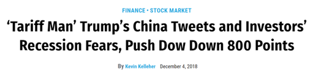

Introduction

The idea for this project came to me a couple years ago while I was on the desk at my previous job on Wall Street. On our floor, we had CNBC running all day, every day in order for us to be able to stay current with the news and see how the markets were doing. While significant movements in the markets are usually brought on by economic reports, political events, or policy changes, the market was experiencing significant volatility one day, and it was because of none of the above. It was simply this:

```{r, ECHO = FALSE}

```

Generally speaking, a market drop more than ~1% is pretty significant. That day, the DOW dropped 3%. This got me thinking - could Donald Trump, one of the most powerful men in the world, who, to put it lightly, tends to be a bit of a loose cannon when it comes to what he says on twitter, really have the power to move markets on a consistent basis through his twitter account? Let's find out: 


```{r, echo = FALSE, include =  FALSE}

library(rlang)
library(Hmisc)
library(hms)
library(textdata)
library(plyr)
library(pillar)
library(dplyr)
library(tidyr)
library(stringr)
library(rjson)
library(jsonlite)
library(tidytext)
library(ggplot2)
library(wordcloud)
library(stringi)
library(broom)
library(readr)
library(plyr)
library(textdata)
library(tidyr)
library(dplyr)
library(stringr)
library(stopwords)
library(tidytext)
library(tm)
library(lexicon)
library(sentimentr)
library(magrittr)
library(ggplot2)
library(zoo)
library(quantmod)
library(tsbox)
library(lsa)
library(NMF)
library(stm)
library(textstem)
library(rio)
library(rlang)
library(Hmisc)
library(hms)
library(textdata)
library(plyr)
library(pillar)
library(dplyr)
library(tidyr)
library(stringr)
library(rjson)
library(jsonlite)
library(tidytext)
library(ggplot2)
library(wordcloud)
library(stringi)
data(stop_words)
```


First, I imported Trump's tweet data from the time he was inagurated to when I started this project (late 2019) and reformed the dataframe into an analyzable format

```{r}

jdata <- read_json("Trump_Twitter_Data.json", simplifyVector = TRUE)

data_frame <- as.data.frame(jdata)

data_frame1 = select(data_frame,-id_str,-source)


data_frame1$substring1 = substr(data_frame1$created_at, 5, 10)
data_frame1$substring2 = substr(data_frame1$created_at,29,30)
data_frame1$date = (paste(data_frame1$substring1, data_frame1$substring2, sep = " "))

data_frame2 <- data_frame1 %>%
  select(date,text)

data_frame2$date = as.Date(data_frame2$date,format="%b %d %y")
data_frame2$text = gsub("\\https.*","",data_frame2$text)

data_frame3 = data_frame2

```

Placed dummy text into blank tweet cells (to not have null text values)

```{r}

for (z in 1:length(data_frame3$text)) {
  if (data_frame3$text[z] == "") {
    data_frame3$text[z] = "text text text"
  }
}


```

Obtained S&P 500 Historical Data via yahoo finance

```{r}

sp500Data <- read.csv("^GSPC.csv")
sp500Data$date = as.Date(sp500Data$date, format = "%Y-%m-%d")

```

Joined the Trump Tweet table and S&P 500 historical data table

```{r}

merged_tables <-merge(data_frame3, sp500Data, by.data_frame3 = "date", by.sp500Data = "date", all.x = TRUE)
summary(merged_tables)

merged_tables1 <- merged_tables %>%
  fill(Open, High, Close, Low, Close, Adj.Close, Volume, PercChange,.direction = "up")
```

Next, because Trump tends to be very emotional in his tweets, I wanted to see if there was any correlation between the sentiment of his tweets and volatility in the market (i.e. does an angry Trump on twitter correlate to higher market volatility?) To do this, I classified each tweet as a specific emotion using the NRC sentiment package

```{r}

class_table <- get_sentiments("nrc")

merged_tables2 <- merged_tables1 %>%
  select(date,text,PercChange) 

sentiment <- merged_tables2 %>%
  unnest_tokens(word,text)

```

Created blank columns for each sentiment

```{r}
merged_tables2$positive = NA
merged_tables2$trust = NA
merged_tables2$negative = NA
merged_tables2$anticipation = NA
merged_tables2$fear = NA
merged_tables2$anger = NA
merged_tables2$joy = NA
merged_tables2$sadness = NA
merged_tables2$disgust = NA
merged_tables2$surprise = NA


WordCount <-sentiment %>%
  group_by(word) %>%
  summarise(Count = n()) %>%
  anti_join(stop_words) %>%
  arrange(desc(Count))

```

Merged sentiment value with word counts 

```{r}

merge_sentiment_count <- merge(class_table, WordCount, by.class_table = "word", by.WordCount = "word") %>%
  group_by(sentiment) %>%
  summarise(Count = sum(Count)) %>%
  arrange(desc(Count))

merge_sentiment_table <- merge(class_table, WordCount, by.class_table = "word", by.WordCount = "word") %>%
  arrange(desc(Count))

```

For fun, I made a word cloud to see in general the most common words - the results aren't too surprising...

```{r}
set.seed(1234)
trump_word_cloud = wordcloud(words = WordCount$word, freq = WordCount$Count, min.freq = 1, max.words = 200, random.order = FALSE, rot.per = 0.35, colors = brewer.pal(8,"Dark2"))
```

The following will read text and determine emotion of that day

```{r}

for (k in 1:length(merged_tables2$date)){
  new_vector = tolower(strsplit(merged_tables$text[k],"\\s+")[[1]])
  new_dataframe = data.frame(matrix(ncol = 2, nrow =length(new_vector)))
  x = c("word", "sentiment")
  colnames(new_dataframe) = x
  for (i in 1:length(new_vector)) {
    new_dataframe$word[i] = new_vector[i]
  }

  


dataframe_sentiment_by_day <-  new_dataframe %>% 
  inner_join(merge_sentiment_table, by = "word") %>%
  select(word,sentiment.y)
  

    
#Setting counters to zero


  
  positive = 0
  trust = 0
  negative = 0
  anticipation = 0
  fear = 0
  anger = 0
  joy = 0
  sadness = 0
  disgust = 0
  surprise = 0


#The following forloop will increment the values based on prevalence in the days' tweet


  
for (i in 1:length(dataframe_sentiment_by_day$sentiment.y)) {
    tryCatch(
    if(dataframe_sentiment_by_day$sentiment.y[i] == "positive") {
      positive = positive + 1.02
    },
    error = function (e) {NULL})
    tryCatch(
    if (dataframe_sentiment_by_day$sentiment.y[i] == "trust") {
      trust = trust + 1.01
    },
    error = function (e) {NULL})
    tryCatch(
    if (dataframe_sentiment_by_day$sentiment.y[i] == "negative") {
      negative = negative + 1.03
    },
    error = function (e) {NULL})
    tryCatch(
    if (dataframe_sentiment_by_day$sentiment.y[i] == "anticipation") {
      anticipation = anticipation + .999
    },
    error = function (e) {NULL})
    tryCatch(
    if (dataframe_sentiment_by_day$sentiment.y[i] == "fear") {
      fear = fear + 1.05
    },
    error = function (e) {NULL}) 
    tryCatch(
    if (dataframe_sentiment_by_day$sentiment.y[i] == "anger") {
      anger = anger + 1.04
    },
    error = function (e) {NULL})
    tryCatch(
    if (dataframe_sentiment_by_day$sentiment.y[i] == "joy") {
      joy = joy + 1
    },
    error = function (e) {NULL})
    tryCatch(
    if (dataframe_sentiment_by_day$sentiment.y[i] == "sadness") {
      sadness = sadness + 1.07
    },
    error = function (e) {NULL})
    tryCatch(
    if (dataframe_sentiment_by_day$sentiment.y[i] == "disgust") {
      disgust = disgust + 1.08
    },
    error = function (e) {NULL})
    tryCatch(
    if (dataframe_sentiment_by_day$sentiment.y[i] == "surprise") {
      surprise = surprise + 1.09
    },
    error = function (e) {NULL})
  
  
  merged_tables2$positive[k] = positive
  merged_tables2$trust[k] = trust
  merged_tables2$negative[k] = negative
  merged_tables2$anticipation[k] = anticipation
  merged_tables2$fear[k] = fear
  merged_tables2$anger[k] = anger
  merged_tables2$joy[k] = joy
  merged_tables2$sadness[k] = sadness
  merged_tables2$disgust[k] = disgust
  merged_tables2$surprise[k] = surprise

}
}
```

The following uses mean imputation to fill in missing values for daily S&P movements


```{r}

merged_tables2 <- merged_tables2 %>%
  mutate(PercChange = ifelse(!is.na(PercChange), PercChange,mean(PercChange, na.rm = TRUE)))

```


The following creates a classifcation vector that will classify each day of tweets as a specific emotion

```{r}

merged_tables2$classification = NA


for (j in 1:length(merged_tables2$classification)) {
    if(((!is.na(merged_tables2$positive[j])) & (merged_tables2$positive[j] > merged_tables2$trust[j]) & (merged_tables2$positive[j] > merged_tables2$negative[j]) & (merged_tables2$positive[j] > merged_tables2$anticipation[j]) & (merged_tables2$positive[j] > merged_tables2$fear[j]) & (merged_tables2$positive[j] > merged_tables2$anger[j])
       & (merged_tables2$positive[j] > merged_tables2$joy[j]) & (merged_tables2$positive[j] > merged_tables2$sadness[j]) & (merged_tables2$positive[j] > merged_tables2$disgust[j]) & (merged_tables2$positive[j] > merged_tables2$surprise[j]))) {
      merged_tables2$classification[j] = "positive"
    }
  

    if(((!is.na(merged_tables2$trust[j])) & (merged_tables2$trust[j] > merged_tables2$positive[j]) & (merged_tables2$trust[j] > merged_tables2$negative[j]) & (merged_tables2$trust[j] > merged_tables2$anticipation[j]) & (merged_tables2$trust[j] > merged_tables2$fear[j]) & (merged_tables2$trust[j] > merged_tables2$anger[j])
       & (merged_tables2$trust[j] > merged_tables2$joy[j]) & (merged_tables2$trust[j] > merged_tables2$sadness[j]) & (merged_tables2$trust[j] > merged_tables2$disgust[j]) & (merged_tables2$trust[j] > merged_tables2$surprise[j]))) {
      merged_tables2$classification[j] = "trust"
    }

    if(((!is.na(merged_tables2$negative[j])) & (merged_tables2$negative[j] > merged_tables2$positive[j]) & (merged_tables2$negative[j] > merged_tables2$trust[j]) & (merged_tables2$negative[j] > merged_tables2$anticipation[j]) & (merged_tables2$negative[j] > merged_tables2$fear[j]) & (merged_tables2$negative[j] > merged_tables2$anger[j])
          & (merged_tables2$negative[j] > merged_tables2$joy[j]) & (merged_tables2$negative[j] > merged_tables2$sadness[j]) & (merged_tables2$negative[j] > merged_tables2$disgust[j]) & (merged_tables2$negative[j] > merged_tables2$surprise[j]))) {
      merged_tables2$classification[j] = "negative"
    }
    if(((!is.na(merged_tables2$anticipation[j])) & (merged_tables2$anticipation[j] > merged_tables2$positive[j]) & (merged_tables2$anticipation[j] > merged_tables2$trust[j]) & (merged_tables2$anticipation[j] > merged_tables2$negative[j]) & (merged_tables2$anticipation[j] > merged_tables2$fear[j]) & (merged_tables2$anticipation[j] > merged_tables2$anger[j])
          & (merged_tables2$anticipation[j] > merged_tables2$joy[j]) & (merged_tables2$anticipation[j] > merged_tables2$sadness[j]) & (merged_tables2$anticipation[j] > merged_tables2$disgust[j]) & (merged_tables2$anticipation[j] > merged_tables2$surprise[j]))) {
      merged_tables2$classification[j] = "anticipation"
    }
    if(((!is.na(merged_tables2$fear[j])) & (merged_tables2$fear[j] > merged_tables2$positive[j]) & (merged_tables2$fear[j] > merged_tables2$trust[j]) & (merged_tables2$fear[j] > merged_tables2$negative[j]) & (merged_tables2$fear[j] > merged_tables2$anticipation[j]) & (merged_tables2$fear[j] > merged_tables2$anger[j])
          & (merged_tables2$fear[j] > merged_tables2$joy[j]) & (merged_tables2$fear[j] > merged_tables2$sadness[j]) & (merged_tables2$fear[j] > merged_tables2$disgust[j]) & (merged_tables2$fear[j] > merged_tables2$surprise[j]))) {
      merged_tables2$classification[j] = "fear"
    }
    if(((!is.na(merged_tables2$anger[j])) & (merged_tables2$anger[j] > merged_tables2$positive[j]) & (merged_tables2$anger[j] > merged_tables2$trust[j]) & (merged_tables2$anger[j] > merged_tables2$negative[j]) & (merged_tables2$anger[j] > merged_tables2$anticipation[j]) & (merged_tables2$anger[j] > merged_tables2$fear[j])
            & (merged_tables2$anger[j] > merged_tables2$joy[j]) & (merged_tables2$anger[j] > merged_tables2$sadness[j]) & (merged_tables2$anger[j] > merged_tables2$disgust[j]) & (merged_tables2$anger[j] > merged_tables2$surprise[j]))) {
      merged_tables2$classification[j] = "anger"
    }
    if(((!is.na(merged_tables2$joy[j])) & (merged_tables2$joy[j] > merged_tables2$positive[j]) & (merged_tables2$joy[j] > merged_tables2$trust[j]) & (merged_tables2$joy[j] > merged_tables2$negative[j]) & (merged_tables2$joy[j] > merged_tables2$anticipation[j]) & (merged_tables2$joy[j] > merged_tables2$fear[j])
           & (merged_tables2$joy[j] > merged_tables2$anger[j]) & (merged_tables2$joy[j] > merged_tables2$sadness[j]) & (merged_tables2$joy[j] > merged_tables2$disgust[j]) & (merged_tables2$joy[j] > merged_tables2$surprise[j]))) {
      merged_tables2$classification[j] = "joy"
    }
    if(((!is.na(merged_tables2$sadness[j])) & (merged_tables2$sadness[j] > merged_tables2$positive[j]) & (merged_tables2$sadness[j] > merged_tables2$trust[j]) & (merged_tables2$sadness[j] > merged_tables2$negative[j]) & (merged_tables2$sadness[j] > merged_tables2$anticipation[j]) & (merged_tables2$sadness[j] > merged_tables2$fear[j])
       & (merged_tables2$sadness[j] > merged_tables2$anger[j]) & (merged_tables2$sadness[j] > merged_tables2$joy[j]) & (merged_tables2$sadness[j] > merged_tables2$disgust[j]) & (merged_tables2$sadness[j] > merged_tables2$surprise[j]))) {
      merged_tables2$classification[j] = "sadness"
    }
    if(((!is.na(merged_tables2$disgust[j])) & (merged_tables2$disgust[j] > merged_tables2$positive[j]) & (merged_tables2$disgust[j] > merged_tables2$trust[j]) & (merged_tables2$disgust[j] > merged_tables2$negative[j]) & (merged_tables2$disgust[j] > merged_tables2$anticipation[j]) & (merged_tables2$disgust[j] > merged_tables2$fear[j])
           & (merged_tables2$disgust[j] > merged_tables2$anger[j]) & (merged_tables2$disgust[j] > merged_tables2$joy[j]) & (merged_tables2$disgust[j] > merged_tables2$sadness[j]) & (merged_tables2$disgust[j] > merged_tables2$surprise[j]))) {
      merged_tables2$classification[j] = "disgust"
    }
    if(((!is.na(merged_tables2$surprise[j])) & (merged_tables2$surprise[j] > merged_tables2$positive[j]) & (merged_tables2$surprise[j] > merged_tables2$trust[j]) & (merged_tables2$surprise[j] > merged_tables2$negative[j]) & (merged_tables2$surprise[j] > merged_tables2$anticipation[j]) & (merged_tables2$surprise[j] > merged_tables2$fear[j])
       & (merged_tables2$surprise[j] > merged_tables2$anger[j]) & (merged_tables2$surprise[j] > merged_tables2$joy[j]) & (merged_tables2$surprise[j] > merged_tables2$sadness[j]) & (merged_tables2$surprise[j] > merged_tables2$disgust[j]))) {
      merged_tables2$classification[j] = "surprise"
    }
}
merged_tables2$classification <- ifelse(is.na(merged_tables2$classification), 'None', merged_tables2$classification)

```

The following changes the PercChange to absolute value 

```{r}

merged_tables2$PercChange = abs(merged_tables2$PercChange)

```

The following defines "market moving" at a percent change greater than 0.7


```{r}
merged_tables2$market_moving = 0

for (q in 1:length(merged_tables2$PercChange)) {
  if (merged_tables2$PercChange[q] > 0.7) {
    merged_tables2$market_moving[q] = 1
  }
}
```

Created emotion index for each tweets


```{r}
merged_tables2$emotionIndex = NA

for (r in 1:length(merged_tables2$emotionIndex)) {
  merged_tables2$emotionIndex[r] = merged_tables2$positive[r] + merged_tables2$trust[r] + merged_tables2$negative[r] + merged_tables2$anticipation[r] + merged_tables2$fear[r] + merged_tables2$anger[r] + merged_tables2$joy[r] + merged_tables2$sadness[r] + merged_tables2$disgust[r] + merged_tables2$surprise[r]
}
```


Checking distribution of data for market moving vs not

```{r}

class_plot = merged_tables2 %>%
  ggplot(aes(x = classification)) +
  geom_bar()
class_plot


dist_plot = merged_tables2 %>%
  ggplot(aes(market_moving)) +
  geom_bar() +
  theme_minimal()
dist_plot  


boxplot = merged_tables2 %>%
  ggplot(mapping = aes(x = as.factor(classification), y = PercChange)) +
  geom_boxplot()
boxplot

addmargins(table(merged_tables2$market_moving))

```

There is about a ~20% chance there is a market moving day, and most of his tweets fall into the "positive" or "negative" category


The following groups dataframe by date

```{r}

merged_tables_by_date = merged_tables2 %>%
  select(-text, -classification) %>%
  group_by(date) %>%
  summarise_all(funs(sum))

merged_tables_bydate_and_perc_change = merged_tables2 %>%
  select(date, PercChange, emotionIndex) %>%
  group_by(date) %>%
  summarise(PercChange = mean(PercChange),
                emotionIndex = sum(emotionIndex))


for (f in 1:length(merged_tables_by_date$market_moving)){
if(merged_tables_by_date$market_moving[f]> 0) {
  merged_tables_by_date$market_moving[f] = 1
}
}
```

Now, I want to attempt to build a regression to see if there's any significance between emotion and large market movements

```{r}

log_test_table = merged_tables_by_date

logTest = glm(market_moving ~ positive + negative + trust + fear + joy + anticipation + surprise + anger + disgust + sadness, data = log_test_table, family = binomial)
summary(logTest)


```

Unfortunately, there doesn't really seem to be much here. There's the presence of some statistical significance, but not enough to definitively justify a correlation.

Let's try something else. Maybe if I can bucket his tweets into different topics using topic modeling, a specific topic might have a higher correlation with volatility.

The below cleans and preps his tweets for insertion into the topic modeling functions.

```{r}


topic_dataframe <- as.data.frame(cbind(merged_tables2$market_moving, merged_tables2$text))  %>%
  mutate(market_moving = V1,
         text = V2,
         doc_id = 0) %>%
  select(text, market_moving, doc_id)

toggle = 1
for (i in 1:length(topic_dataframe$doc_id)) {
  topic_dataframe$doc_id[i] = toggle
  toggle = toggle + 1
  
}


cleanDataframe = topic_dataframe %>%
  mutate(text = as.character(text), 
         text = str_replace_all(text, "\n", " "),   
         text = str_replace_all(text, "(\\[.*?\\])", ""),
         text = str_squish(text), 
         text = gsub("([a-z])([A-Z])", "\\1 \\2", text), 
         text = removeWords(text, c("’", stopwords(kind = "en"))), 
         text = removePunctuation(text), 
         text = removeNumbers(text)) %>%
  as.data.frame()


set.seed(1001)

holdoutRows = sample(1:nrow(cleanDataframe), 100, replace = FALSE)

tweetText = textProcessor(documents = cleanDataframe$text[-c(holdoutRows)],
                          metadata= cleanDataframe[-c(holdoutRows), ],
                          stem = FALSE,
                          lowercase = FALSE)

tweetprep <- prepDocuments(documents = tweetText$documents,
                           vocab = tweetText$vocab,
                           meta = tweetText$meta)

```


Then, I ran a k Test to determine optimal number of topics 

```{r}

#kTest <- searchK(documents = tweetprep$documents,
#vocab = tweetprep$vocab,
#K = c(3,4,5,10,20), verbose = FALSE)

load("kTest.RData")
plot(kTest)
```


It looks like 10 topics is the best, based on semantic coherence.

The below then buckets each tweet into 10 topics:

topics10 = stm(documents = tweetprep$documents,
               vocab = tweetprep$vocab, seed = 1001,
               K = 10, verbose = FALSE)


```{r}

load("topcis10.RData")
plot(topics10)


labelTopics(topics10)

findThoughts(topics10, texts = tweetprep$meta$text, n = 1)

head(topics10$theta[,1], 10)
str(topics10$theta, 10)

```

Based on the available data from the above topics: I have assigned each topic the following label:

1: US White House & Military (18%)
3: Donald Trump (wtf??) (15%)
5: Fake News (again... wtf) (12%)
9: Witch Hunt (11%)
8: US / Mexico border (11%)
6: Democrats (7%)
7: American Jobs (7%)
4: Foreign Policy and Trade (7%)
10: State of US Economy (6%)
2: US Election and Nancy Pelosi (6%)

Couple of observations here: 
1. He literally spends 15% of his tweets talking about himself...
2. Another ~23% he spends complaining about fake news and the witch hunt against him
3. Poor Nancy Pelosi.....
While these observations are, well, quite hilarious, I don't see him complaining about unfair treatment from Democrats as being market moving. His tweets on foreing policy, on the other hand, could be...


Now that I have a topic assigned to each tweet, I want to isolate the tweets that fall into the China / trade policy category.


```{r}

TopicModel2 = as.data.frame(cbind(tweetprep$meta$text, tweetprep$meta$market_moving,tweetprep$meta$doc_id, topics10$theta))
TopicModel2$V4 = as.numeric(as.character(TopicModel2$V4))
TopicModel2$V5 = as.numeric(as.character(TopicModel2$V5))
TopicModel2$V6 = as.numeric(as.character(TopicModel2$V6))
TopicModel2$V7 = as.numeric(as.character(TopicModel2$V7))
TopicModel2$V8 = as.numeric(as.character(TopicModel2$V8))
TopicModel2$V9 = as.numeric(as.character(TopicModel2$V9))
TopicModel2$V10 = as.numeric(as.character(TopicModel2$V10))
TopicModel2$V11 = as.numeric(as.character(TopicModel2$V11))
TopicModel2$V12 = as.numeric(as.character(TopicModel2$V12))
TopicModel2$V13 = as.numeric(as.character(TopicModel2$V13))


TopicModel2$V4Max = as.numeric(0)
TopicModel2$V8Max = as.numeric(0)
TopicModel2$V2 = as.numeric(as.character(TopicModel2$V2)) - 1 
colnames(TopicModel2) = c("text", "Market_Moving_Dummy", "ID", "Topic1", "Topic2", "Topic3", "Topic4", "Topic5", "Topic6", "Topic7", "Topic8", "Topic9", "Topic10", "4Max", "8Max")

```

Now, the below is running a logistic regression to see if there is a correlation between "Market moving" and the probability of being within topic 4

```{r}
log_table = TopicModel2 %>%
  select(-"4Max", -"8Max", -"ID")


logit_mod <-
  glm(Market_Moving_Dummy~ Topic4 , family = binomial(link = 'logit'), data = log_table)

summary(logit_mod)
```

VERY statistically significant! With a coefficient of 2.07 and a p-value of 1.02e-12, I can say there is statistical significance between the probability a tweet belongs to the "Foreign Policy and Trade" topic and the probability the tweet is associated with market volatility.
In other words, the more Trump tweets about foreign policy and the ongoing trade war with China, make sure you watch the market for that day because it has probably moved a fair amount. 

The below tweets are examples of those that follow the most into the "Foreign Policy and Trade" category and thus have the highest correlation to market volatility. Unfortunately, the infamous "covfefe" tweet didn't make the cut...

```{r, ECHO = FALSE}
knitr::include_graphics("Trump_tweets.png")
```

In conclusion, it's clear that Wall Street is paying attention to what Trump is saying on his twitter account, and clearly doesn't like it when he threatens to heighten trade escalations via twitter. The cool thing about this project is that it definitely doesn't have to be confined to just Donald Trump either - observations similar to this can be observed everywhere. For example, when Elon Musk, another incredibly powerful individual who is very liberal with what he says on twitter, tweets that his stock price is too high, Tesla's stock price tanks 10%. Im the future, I would love to be able to apply this process to other high rankings officials and the stock of their corresponding organizations. Until next time!


